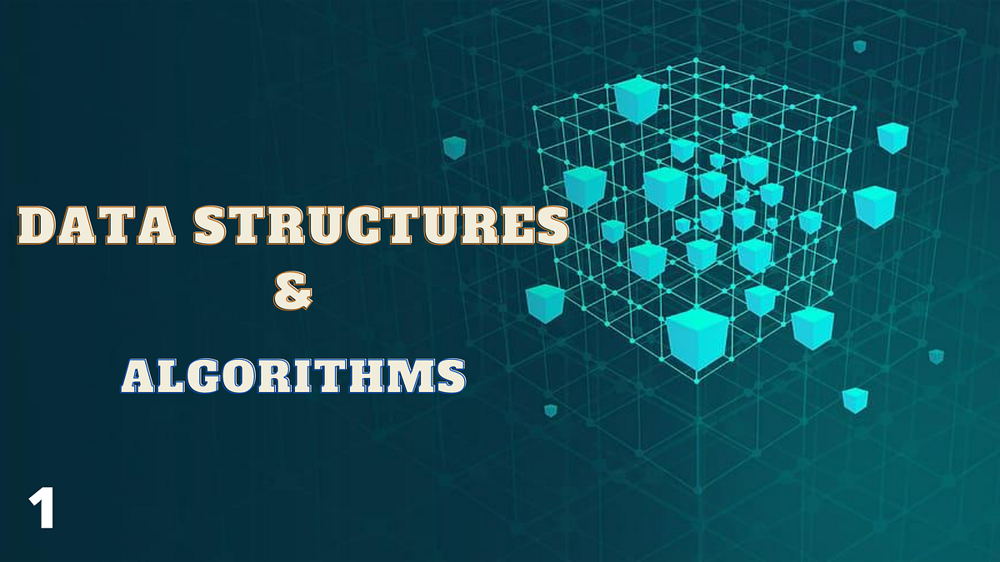

## Data Structures and Algorithms in Kotlin
This is a GitHub repository containing implementations and explanations of various data structures[⌝](https://en.wikipedia.org/wiki/Data_structure) and algorithms[⌝](https://en.wikipedia.org/wiki/Algorithm) in Kotlin programming language. The repository covers a wide range of topics including arrays, linked lists, stacks, queues, trees, sorting algorithms, searching algorithms, and dynamic programming. Each implementation is accompanied by clear and concise code comments explaining the purpose and functionality of the code. The repository provides a great resource for anyone looking to learn or improve their understanding of data structures and algorithms using Kotlin.

### Overview
- [Data Structures](https://github.com/Galang211/Kotlin-data-structures-and-algorithms/tree/master/src/main/kotlin/data_structures)
    - Arrays[⌝](https://github.com/Galang211/Kotlin-data-structures-and-algorithms/tree/master/src/main/kotlin/data_structures/arrays)
    - Hash Tables[⌝](https://github.com/Galang211/Kotlin-data-structures-and-algorithms/tree/master/src/main/kotlin/data_structures/hash_tables)
    - Linked Lists[⌝](https://github.com/Galang211/Kotlin-data-structures-and-algorithms/tree/master/src/main/kotlin/data_structures/linked_list)
    - Stacks[⌝](https://github.com/Galang211/Kotlin-data-structures-and-algorithms/tree/master/src/main/kotlin/data_structures/stacks)
    - Queues[⌝](https://github.com/Galang211/Kotlin-data-structures-and-algorithms/tree/master/src/main/kotlin/data_structures/queues)
    - Trees[⌝](https://github.com/Galang211/Kotlin-data-structures-and-algorithms/tree/master/src/main/kotlin/data_structures/trees)
    - Graphs[⌝](https://github.com/Galang211/Kotlin-data-structures-and-algorithms/tree/master/src/main/kotlin/data_structures/graphs)
- [Algorithms](https://github.com/Galang211/Kotlin-data-structures-and-algorithms/tree/master/src/main/kotlin/algorithms)
    - Recursion[⌝](https://github.com/Galang211/Kotlin-data-structures-and-algorithms/tree/master/src/main/kotlin/algorithms/recursion)
        - Factorial
        - Fibonacci
        - Reverse String
    - Sorting[⌝](https://github.com/Galang211/Kotlin-data-structures-and-algorithms/tree/master/src/main/kotlin/algorithms/sorting)
        - Bubble Sort
        - Selection Sort
        - Insertion Sort
        - Merge Sort
        - Quick Sort
    - Searching[⌝](https://github.com/Galang211/Kotlin-data-structures-and-algorithms/tree/master/src/main/kotlin/algorithms/searching)
        - Linear Search
        - Binary Search
        - BFS
        - Jump Search
        - Interpolation Search
        - Sequential Search
    - Sliding Window[⌝](https://github.com/Galang211/Kotlin-data-structures-and-algorithms/tree/master/src/main/kotlin/algorithms/sliding_window)
        - Count Max Sum Sub array
        - Length Of Longest Sub String
        - Max Sum Sub Array
- [Dynamic Programming](https://github.com/Galang211/Kotlin-data-structures-and-algorithms/tree/master/src/main/kotlin/dynamic_programming)
    - Memoization[⌝](https://github.com/Galang211/Kotlin-data-structures-and-algorithms/tree/master/src/main/kotlin/dynamic_programming/memoization)
    - Dynamic Fibonacci[⌝](https://github.com/Galang211/Kotlin-data-structures-and-algorithms/tree/master/src/main/kotlin/dynamic_programming/dynamic_fibonacci)
    - Climb Stairs[⌝](https://github.com/Galang211/Kotlin-data-structures-and-algorithms/tree/master/src/main/kotlin/dynamic_programming/climb_stairs)
    - Coin Change[⌝](https://github.com/Galang211/Kotlin-data-structures-and-algorithms/tree/master/src/main/kotlin/dynamic_programming/coin_change)
    - Edit Distance[⌝](https://github.com/Galang211/Kotlin-data-structures-and-algorithms/tree/master/src/main/kotlin/dynamic_programming/edit_distance)
    - Knapsack Problem[⌝](https://github.com/Galang211/Kotlin-data-structures-and-algorithms/tree/master/src/main/kotlin/dynamic_programming/knapsack_problem)
    - Longest Common Sub Sequense[⌝](https://github.com/Galang211/Kotlin-data-structures-and-algorithms/tree/master/src/main/kotlin/dynamic_programming/longest_common_subsequense)
    - Matrix Chain Multiplication[⌝](https://github.com/Galang211/Kotlin-data-structures-and-algorithms/tree/master/src/main/kotlin/dynamic_programming/matrix_chain_multiplication)
    - Pascal Tri Angel[⌝](https://github.com/Galang211/Kotlin-data-structures-and-algorithms/tree/master/src/main/kotlin/dynamic_programming/pascal_tri_angel)
    - Unique Paths[⌝](https://github.com/Galang211/Kotlin-data-structures-and-algorithms/tree/master/src/main/kotlin/dynamic_programming/memoization/unique_paths)
### Get started
1. Clone or download the repository and open it on your favorite IDE. (Recommended IDE: [IntelliJ IDEA](https://www.jetbrains.com/idea/download/))
2. Checkout the implementation and explanation of various data structures and algorithms and try them out.